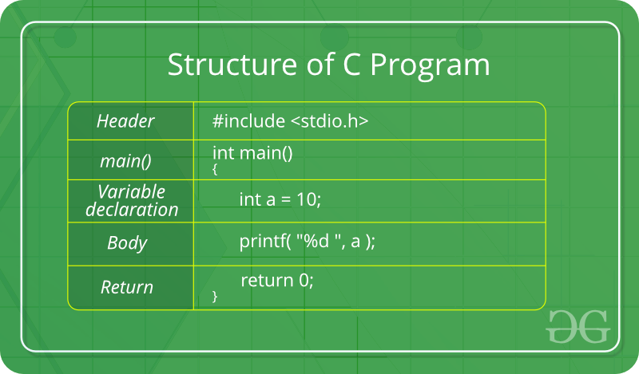

# Introduction to C Programming

**'C'** is a procedural programming language. It was initially developed by Dennis Ritchie in the year 1972. It was mainly developed as a system programming language to write an operating system. The main features of the C language include low-level memory access, a simple set of keywords, and a clean style, these features make C language suitable for system programmings like an operating system or compiler development. Many later languages have borrowed syntax/features directly or indirectly from the C language. Like syntax of Java, PHP, JavaScript, and many other languages are mainly based on the C language. C++ is nearly a superset of C language \(Few programs may compile in C, but not in C++\).

## **Beginning with C programming:**

### 1. **Structure of a C Program:**

After the above discussion, we can formally assess the structure of a C program. By structure, it is meant that any program can be written in this structure only. Writing a C program in any other structure will hence lead to a Compilation Error. The structure of a C program is as follows:



### 2. **Header Files Inclusion:**

The first and foremost component is the inclusion of the Header files in a C program. A header file is a file with extension .h which contains C function declarations and macro definitions to be shared between several source files. Some of C Header files: 1. stdio.h – Defines core input and output functions 2. stdint.h – Defines exact width integer types. 3. stdlib.h – Defines numeric conversion functions, pseudo-random network generator, memory allocation 4. string.h – Defines string handling functions 5. math.h – Defines common mathematical functions

### 3. **Main Method Declaration:**

The next part of a C program is to declare the main\(\) function. The syntax to declare the main function is: **Syntax to Declare the** **main method:**

```text
 int main()

 {}
```

### 4. **Variable Declaration:**

The next part of any C program is the variable declaration. It refers to the variables that are to be used in the function. Please note that in the C program, no variable can be used without being declared. Also in a C program, the variables are to be declared before any operation in the function. **Example:**

```text
 int main()

 {

 int a;
```

### 5. **Body:**

The body of a function in the C program, refers to the operations that are performed in the functions. It can be anything like manipulations, searching, sorting, printing, etc. **Example:**

```text
 int main()

 {

 int a;

 printf('%d";, a);
```

### 6. **Return Statement:**

The last part of any C program is the return statement. The return statement refers to the returning of the values from a function. This return statement and return value depend upon the return type of the function. For example, if the return type is void, then there will be no return statement. In any other case, there will be a return statement and the return value will be of the type of the specified return type. **Example:**

```text
 int main()

 {

 int a;

 printf("%d";, a);

 return 0;

 }
```

