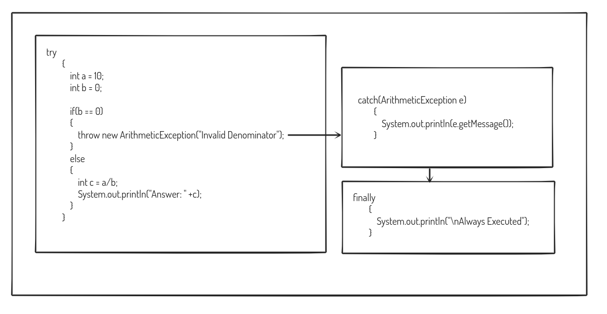

# Exceptions

Exceptions are runtime error handling methods. Instead of crashing the application, this prevents it and shows warning messages to the user.

Keywords: **try, catch, finally,  throw, throws**

Class: Exception

Examples

- ArrayIndexOutOfBounds
- ArithmeticException
- FileNotFoundException

## Checked v/s Unchecked

Checked exceptions are those that are checked by the compiler to prevent runtime errors.  Whereas Unchecked Exceptions are those which are not checked by the compiler and will be resulting in runtime error.

### Checked Exception

- ClassNotFoundException
- IOException
- SQLException

### Unchecked Exceptions

- NullPointerException
- ClassCastException
- ArithmeticException
- DateTimeException
- ArrayStoreException

### Syntax

```java
try
{
	//Code Statements
	/*It is in this block that we type in the code that may result in an error.*/
}
catch
{
	//Code Statements
	/*It is in this block that we type the code to say what to do if its an error*/
}
finally
{
	//Code Statements
/*This code block will execute in all cases*/
}
```

## Sample Program

This is a simple program that detects and displays the division by zero exception to the user.

```java
class Test
{
    public static void main(String args[])
    {
        try
        {
            int a = 5;
            int b = 0;
            System.out.println("Answer: "+(a/b));
        }
        catch(ArithmeticException e)
        {
            System.out.println(e.getMessage());
        }
        finally
        {
            System.out.println("\nAlways Executed!");
        }
    }
}

/*
Program Output
java -cp /tmp/MwzEwBdAU5 Test
/ by zero
Always Executed!
*/
```

Note: Multiple catch statements can be included in a program to catch multiple errors, but make sure that if you include the catch (Exception e), you put it at the end only (i.e. it should be the last exception)

Based on the use-case. The try-catch block can also be used in a nested fashion.

### Finally, vs Final Keyword

- Finally, is a statement block used in try-catch statements, whereas final is a keyword used along with variable, function and class.

### Throw Keyword

The throw keyword is used to throw an exception object explicitly. This keyword is given inside the method body and is followed by an instance of the exception class

- throw new exceptionclassname

```java
class Test
{
    public static void main(String args[])
    {
        try
        {
            int a = 10;
            int b = 0;
            
            if(b == 0)
            {
                throw new ArithmeticException("Invalid Denominator");
            }
            else
            {
                int c = a/b;
                System.out.println("Answer: " +c);
            }
        }
        catch(ArithmeticException e)
        {
            System.out.println(e.getMessage());
        }
				finally
        {
            System.out.println("\nAlways Executed");
        }
    }
}

/*
Program Output
java -cp /tmp/MwzEwBdAU5 Test
Invalid Denominator
Always Executed
*/
```



### Throws Keywords

throws keyword is **always used with function signatures** to indicate that the function may result in the mentioned exception if the parameters passed aren’t correct. It is the responsibility of the user using the function to handle it.

- The keyword throws is followed by a class.
- Can handle multiple exceptions

```java
class Test
{
    public void div(int a, int b)throws ArithmeticException
    {
        int c = a/b;
        System.out.println("\nAnswer: "+c);
    }
    
    public static void main(String args[])
    {
        try
        {
            Test t = new Test();
            t.div(10,5); //Correct Set of Parameters
            t.div(10,0); //Wrong Inputs
        }
        catch(ArithmeticException e) //Exception Handled by user
        {
            System.out.println(e.getMessage());
        }
    }
}

/*
Program Output
java -cp /tmp/MwzEwBdAU5 Test
Answer: 2
/ by zero
*/
```

### Custom Exception

Class Prime Exception was created by the user, and to indicate that it is an exception class, it should be inheriting the class Exception. 

If an exception occurs, the steps in the try-block that follow it are skipped, and control is transferred to the catch block. That is why the step “System.out.println(number+" is Prime");” wasn’t shown in the output.

```java
class PrimeException extends Exception
{
    private String message;
    public PrimeException(String message)
    {
        this.message = message;
    }
    
    public String getMessage()
    {
        return message;
    }
}

class Test
{
    public static void main(String args[])
    {
        try
        {
            int number = 70;
            int flag = 0;
            
            for(int i = 2;i<=number/2;i++)
            {
                if(number%i == 0)
                {
                    flag = 1;
                    break;
                }
            }
            
            if(flag == 1)
                throw new PrimeException(number+ " is not Prime");
            System.out.println(number+" is Prime");
        }
        catch(PrimeException e)
        {
            System.out.println(e.getMessage());
        }
        
    }
}

/*
Program Ouput
java -cp /tmp/MwzEwBdAU5 Test
70 is not Prime
*/
```

