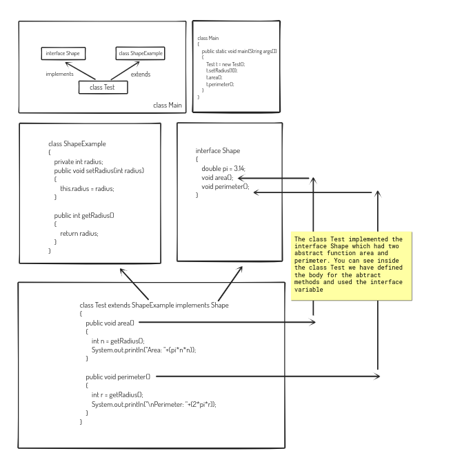

# Interface

Keyword: **implements**

In Java, an interface can be represented as the blueprint of a class, since it has only static constants and abstract methods. In Java, an interface can be used to achieve the concept of multiple inheritance.

- The variables in an interface are `public`, `static` and `final`
- Interface methods are by default `abstract` and `public`
- On implementation of an interface, you must override all of its methods, i.e.. You should define body for the abstract methods in an interface while implementing it.

```java
interface Shape
{
    double pi = 3.14;
    void area();
    void perimeter();
}
class ShapeExample
{
    private int radius;
    public void setRadius(int radius)
    {
        this.radius = radius;
    }
    
    public int getRadius()
    {
        return radius;
    }
}
class Test extends ShapeExample implements Shape
{
    public void area()
    {
        int n = getRadius();
        System.out.println("Area: "+(pi*n*n));
    }
    
    public void perimeter()
    {
        int r = getRadius();
        System.out.println("\nPerimeter: "+(2*pi*r));
    }
}
class Main
{
    public static void main(String args[])
    {
        Test t = new Test();
        t.setRadius(10);
        t.area();
        t.perimeter();
    }
}

/*java -cp /tmp/Uy1KWJNJCL Main
Area: 314.0
Perimeter: 62.800000000000004
*/
```

