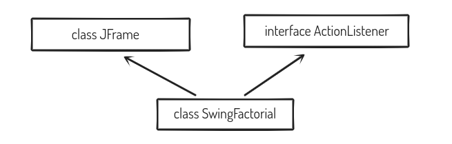

# Swing

**Swing** is a set of user interface components for Java applications. In other words, Swing is the graphical user interface toolkit that is used for developing Windows-based Java applications or programs. It is the successor of AWT

Unlike AWT, Java Swing provides platform-independent and lightweight components.

Package: javax.swing, java.awt.event.*;

All the Swing Programs are examples of Multiple Inheritance in Java.



### Features of Swing

- Platform Independent
- Lightweight
- Allows Plugging
- Manageable
- MVC
- Customizable

### Common Components

- JLabel
- JTextField
- JButton

```java
import java.awt.event.*;
import javax.swing.*;
class SwingFactorial extends JFrame implements ActionListener
{
	private JLabel fn;
		
	private JTextField ifn;
		
	private JButton calculate;
		
	private JLabel result;
	
	public SwingFactorial()
	{	
		setSize(500,400);
		setLayout(null);
		
		fn = new JLabel("First Number");
		fn.setBounds(20,50,125,50);
		add(fn);
			
		ifn = new JTextField();
		ifn.setBounds(160,60,150,25);
		add(ifn);
		
		calculate = new JButton("Find");
		calculate.setBounds(25,100,100,25);
		add(calculate);
			
		result  = new JLabel();
		result.setBounds(25,150,150,25);
		add(result);
		
		calculate.addActionListener(this);
		
	}
	
	public static void main(String args[])
	{
		SwingFactorial s = new SwingFactorial();
		s.setVisible(true);
	}
	
	public void actionPerformed(ActionEvent e)
	{
		Integer ans = 1;
		Integer fone = Integer.parseInt(ifn.getText());
		
		for(int i=1;i<=fone;i++)
		{
			ans = ans*i;
		}
		
		result.setText("Result = "+(ans.toString()));	
		
	}
	
}

```


## Flow of Program

### Step 1

When the program is first run, the main function of the program gets invoked, which in-turn invokes the default constructor and sets the visibility of the JFrame to true.

### Step 2

The triggered default constructor sets size of the JFrame(.**setSize()**), Layout and initializes the defined data members by setting their location on the JFrame using the function .**setBounds** and adds them to the JFrame using the function .add()

### Step 3

After this step the JFrame would be visible as a new window. As shown in the image above. When the user enters the number and **clicks the find button. The actionPerformed function of the code gets invoked since actionListener was added to the button in the constructor.**

The function finds the factorial of the number and adds it to the JFrame Label result using the function **.setText()**