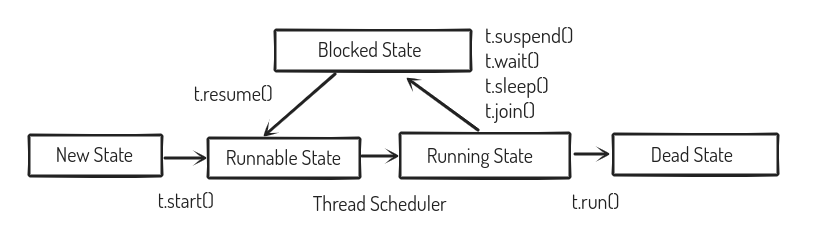

# Thread

Threads are used to execute two objects simultaneously. There is no fixed pattern for the execution of two threads.

Class: **Thread**

Keyword: **synchronized**

Function: run(), start(), join()

- Which ever class has inherited the Thread class must use the run function.
- .start() is used for starting the parallel-execution of threads.

### Thread Life Cycle

Thread is well known for independent execution. During the life cycle, a thread can move to different states and JVM controls thread execution

- New State → Born
- Runnable State → Ready
- Running State → Execution
- Waiting State → Blocked
- Dead State → Exit



### Start Function

Just as the name of the function implies, it is used to start the execution of a thread. When a start function has been invoked, control goes to run().

.start() → run()

### Normal Execution

```java
class Test
{
    public void display(String msg)
    {
        for(int i = 1;i<=100;i++)
        {
            System.out.println(msg);
        }
    }
    public static void main(String args[])
    {
        Test t = new Test();
        t.display("Good");
        t.display("Morning");
    }
}
```

### Thread Execution

```java
class Display extends Thread
{
    String msg;
    public Display(String msg)
    {   
        this.msg = msg;
    }
    
    public void run()
    {
        for(int i = 1; i <= 100; i++)
        {
            System.out.println(msg);
        }
    }
}

class Test
{
    public static void main(String args[])
    {
        Display obj1 = new Display("Good");
        Display obj2 = new Display("Morning");
        
        obj1.start();
        obj2.start();

				//obj1.join();
				//obj2.join();
    }
}
```

### Join Function

Threads are considered efficient only if both of them start and end at the same time. The second thread has to wait until the first thread has finished its execution, and then they both exit simultaneously.

To achieve such an output, changes have to occur internally, and for that we use .join() from the thread class.

```java
try
{
	Display d1 = new Display(5);
	Display d2 = new Display(10);
	
	d1.start();
	d2.start();
	
	d1.join();
	d2.join();
}
catch(InterruptedException e)
{
	//Display Exception
}
```

## Thread Synchronization

There are two types of thread synchronization

- Method Synchronization
- Block Synchronization

```java
import java.util.Scanner;
class Sync
{
	public static void main(String args[])
	{
		try
		{
			Display d1 = new Display(5);
			Display d2 = new Display(10);
			d1.start();
			d2.start();
			
			d1.join();
			d2.join();
		}
		catch(InterruptedException e)
		{
			System.out.println(e.getMessage());
		}
	}
}
class Display extends Thread
{
	private int number;
	public Display(int number)
	{
		this.number = number;
	}
	
	public synchronized void printing() //Method Synchronization
	{
		System.out.println("\nMultiplication Table for " +number);
		for(int i = 1;i<=10;i++)
		{
			System.out.println(i+" * "+number+" = "+(i*number));
		}
	}
	
	public void run()
	{
		printing();
	}
}

/*
Program Output
Multiplication Table for 5
1 * 5 = 5
2 * 5 = 10
3 * 5 = 15
4 * 5 = 20
5 * 5 = 25
6 * 5 = 30
7 * 5 = 35
8 * 5 = 40
9 * 5 = 45
10 * 5 = 50

Multiplication Table for 10
1 * 10 = 10
2 * 10 = 20
3 * 10 = 30
4 * 10 = 40
5 * 10 = 50
6 * 10 = 60
7 * 10 = 70
8 * 10 = 80
9 * 10 = 90
10 * 10 = 100
*/
```


When the keyword "synchronized” is used along with a function signature, only one thread can execute such a function at a time, and the other thread will have to wait until the execution of the current thread finishes.

The primary goal of synchronization is to overcome the problem of multithreading, which occurs when multiple threads attempt to access a common resource at the same time, potentially yielding incorrect results. Synchronization is used to prevent it.

### Runnable Interface

Threads can be implemented in Java using two methods

- One is my inheriting the Thread Class
- Other is my implementing the Runnable Interface
    - If a class is being created using the runnable Interface. Two objects need to be created for the execution of it as a thread
        - classname objectname  = new classname()
        - Thread threadname = new Thread(objectname);