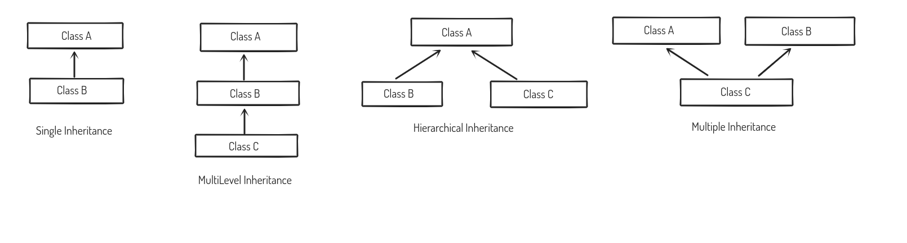

# CST205 Object Oriented Programming Using Java
#### INDEX

Please note that the information provided in this document is not comprehensive and is primarily focused on coding concepts rather than theoretical concepts (Module 1). This document is a work in progress and should be used only as a quick reference. If you notice any errors or have any suggestions feel free to open a pr and add.
Email: aswinasokofficial@gmail.com

# Theory

[Thread](CST205N/Thread.md)

[Input & Output Operations](CST205N/Input%20&%20Output%20Operations.md)

[Swing](CST205N/Swing.md)

[Exceptions](CST205N/Exceptions.md)

[Strings](CST205N/Strings.md)

[Operations on Files](CST205N/Operations%20on%20Files.md)

[Interface](CST205N/Interface.md)

[SQL & Database](CST205N/SQL%20&%20Database.md)

## Programs

[Familiarization of Inheritance](CST205N/Familiarization%20of%20Inheritance.md)

[Abstract Class](CST205N/Abstract%20Class.md)

[Prime Number](CST205N/Prime%20Number.md)

[Method Overloading](CST205N/Method%20Overloading.md)

[Method Overriding](CST205N/Method%20Overriding.md)

[File Stream](CST205N/File%20Stream.md)

[File Reader/Writer](CST205N/File%20Reader%20Writer.md)


## Constructors

- Point About Constructors
    - Constructors are a function having the same name as class. Constructors are used to initialize a class. There are two types of constructors: default and parameterized.
    - Constructors should always be public. Constructors have no return type. Not even void.
    - Default Constructor will run automatically if nothing is present.
- Keyword: **super**
- Super must be included as the first line inside the Constructor body, or else it will result in an error.

[Flow of Constructor](CST205N/Flow%20of%20Constructor.md)

## Inheritance

- Keyword: **extends**
- **While drawing, always use the upwards arrow.**

Inheritance is the property by which a class uses the properties of another class. The class from which the features are extracted is called Base Class. The class that is acquiring the features is called the child class, subclass, or derived class.

### Types of Inheritance

- Single/Simple
- Hierarchical
- Multi-Level
- Multiple Inheritance
    - Multiple Inheritance is not possible by default in Java, but it can be implemented using the interface. i.e. **a class can inherit another class and implement multiple interfaces at the same time.** Thereby implementing the concept of Multiple Inheritance.



## This Keyword

> This is a **reference variable** that refers to the current object.
> 

If both the class variable and the function parameter have the same name in this case, then this keyword is used to reference the object that was initialized. 

```java
private String name;
private int age;
void Person(String name, int age)
{
	this.name = name;
	this.age = age;
}
```

## Method Overloading

- Keywords: Polymorphism(Many-form)

Methods with the same name and different parameters are called "Method Overloading”. Either the number of arguments or the data type of the arguments should be different. Return type won’t affect Method Overloading.

## Method Overriding

The property due to which the child class overrides the parent class function with the same name is called Method Overriding. The child class overrides the parent class because the object was created for the child class (Inheritance).

The function of the parent class with the same name can be called manually using the super.display();

super keyword works only for immediate parent.

## Final Keyword

Keyword: **final**

- Used with Variables
    - **final** float p;
    - Once a variable is made final (constant) its value cannot be changed throughout the program
- Used with Methods
    - public **final** void display()
    - When a method has been made final, it cannot be overridden by the child class or the base class
        
        
        
- Used with Class
    - **final** class Person
    - When a class has been made final, it cannot be inherited by a child class.
        
        
        
    
    ## Static Keyword
    
    - Used with Variables
        
        In Java, variables cannot be initialized directly inside a class. But, however,  if a variable is made static at declaration time, it can be initialized then itself.  The memory of a static variable is only done once. One time allocation.
        
        Static variables are those variables which can be initialized at the time of the declaration.
        
        - private static int  = 5;
    - Used with Methods
        
        Static methods can access only static data members
        
        Static methods can be called without object creation.
        

## Access Specifiers in Java

Access specifiers are specific sets of keywords that, when combined with a code block, limit their use. There are mainly four types of access specifiers in Java.

- Default
    - When no access specifier is added with a class, method or data member - it is said to have the default access modifier.
    - The data members, classes, or methods that are not declared using any access modifiers i.e. Having default access modifier are accessible **only within the same package.**
- Private
    - Keyword: **private**
    - Accessible only within the same class. Even other classes of the same package will not be able to access them.
- Protected
    - Keyword: **protected**
    - • The methods or data members declared as protected are **accessible within the same package or subclasses in different packages.**
- Public
    - Keyword: **public**
    - No Restrictions can be access from anywhere

## Scope Table

| Scope | default | private | protected | public |
| --- | --- | --- | --- | --- |
| Same Class | true | true | true | true |
| Same Package
Child Class | true | false  | true | true |
| Same Package
Non-Child Class | true | false  | true | true |
| Different Package
Child Class | false | false  | true | true |
| Different Package
Non-Child Class | false | false  | false | true |